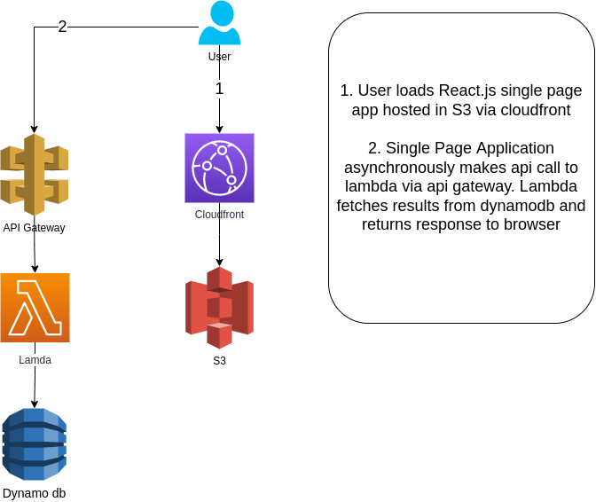

# airview-aws-demo-environment

This repo contains the resources neccesary to deploy a basic application to AWS for the purpose of demonstrating AirView.

## Architecture

The application is a basic html/javascript single page application with a backend api which renders results from a database.

 

\
## Deployment

Deployment is via Cloudformation. e.g.

`aws cloudformation deploy --template-file cloudformation/app_template.yml --stack-name airview-demo-tmp  --capabilities CAPABILITY_NAMED_IAM`

After deployment, find the url of the Cloudfront distribution and load in the browser. You may also wish to add some records to the `AirviewDemoDB` to see these displayed in the page.
